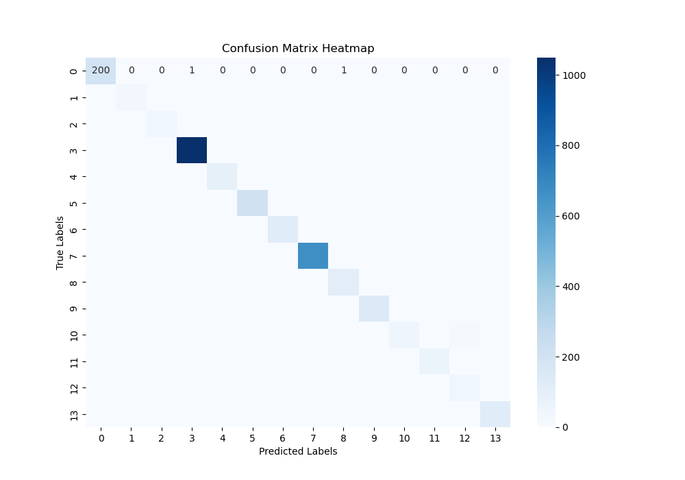

# Data-Science-Hackathon-by-upGrad

# Ecommerce Product Categorization

## Project Overview

This project is part of a Data Science Hackathon focused on categorizing ecommerce products based on their descriptions. Using Logistic Regression and TF-IDF vectorization, the model predicts the product category from textual descriptions. The main goal of this project is to classify products into predefined categories using machine learning techniques.

### Objectives:
- Clean and preprocess the dataset.
- Convert textual data into numeric form using **TF-IDF Vectorization**.
- Build and train a **Logistic Regression** model for multiclass classification.
- Tune hyperparameters using **GridSearchCV** to optimize the model.
- Evaluate model performance using metrics such as accuracy, precision, recall, F1-score, and confusion matrix.
- Make predictions on unseen data and save the results.

---

## Dataset

The dataset used for this project is a collection of ecommerce product descriptions with their associated product categories.

### Features:
- `description`: Textual descriptions of products.
- `product_category_tree`: Target variable indicating the category of the product.

### Preprocessing Steps:
1. **Handle Missing Data**: Drop the `brand` column due to a high number of missing values and remove rows with any missing data.
2. **Label Encoding**: Convert the target variable (`product_category_tree`) to numerical labels using `LabelEncoder`.
3. **TF-IDF Vectorization**: Convert the product descriptions into TF-IDF vectors for numerical representation of text data.

---

## Dependencies

The following Python libraries are required:
- `pandas`
- `scikit-learn`
- `seaborn`
- `matplotlib`

You can install these packages using:
```bash
pip install pandas scikit-learn seaborn matplotlib
```

---

## Model Pipeline

### 1. Data Preprocessing
- **Dropping Columns**: Dropped the `brand` column with many missing values.
- **Removing Missing Rows**: Rows with missing values were dropped.

```python
dataset.drop(columns=["brand"], inplace=True)
dataset.dropna(inplace=True)
```

### 2. Label Encoding
- Converted the `product_category_tree` into numerical labels to be used by the Logistic Regression model.
  
```python
from sklearn.preprocessing import LabelEncoder
le = LabelEncoder()
dataset["en_product_category_tree"] = le.fit_transform(dataset["product_category_tree"])
```

### 3. TF-IDF Vectorization
- Used `TfidfVectorizer` to convert textual product descriptions into numerical vectors.

```python
from sklearn.feature_extraction.text import TfidfVectorizer
tfidf = TfidfVectorizer()
X_tfidf = tfidf.fit_transform(dataset["description"])
```

### 4. Train-Test Split
- Split the data into 80% training and 20% testing sets.

```python
from sklearn.model_selection import train_test_split
X = dataset["description"]
y = dataset["product_category_tree"]
x_train, x_test, y_train, y_test = train_test_split(X_tfidf, y, test_size=0.2, random_state=42)
```

### 5. Model Selection: Logistic Regression
- Trained a Logistic Regression model on the vectorized data.

```python
from sklearn.linear_model import LogisticRegression
lr = LogisticRegression()
lr.fit(x_train, y_train)
```

### 6. Hyperparameter Tuning: GridSearchCV
- Tuned the model's hyperparameters (`C` and `solver`) using grid search.

```python
from sklearn.model_selection import GridSearchCV
parameters = {'C': [0.1, 1, 10, 100], 'solver': ['newton-cg', 'lbfgs', 'liblinear']}
grid_search = GridSearchCV(LogisticRegression(), parameters, cv=5)
grid_search.fit(x_train, y_train)
```

### 7. Evaluation
- Used the test dataset to evaluate the model's performance using accuracy, classification report, and confusion matrix.

```python
from sklearn.metrics import accuracy_score, classification_report, confusion_matrix

# Predictions on test data
y_pred = best_model.predict(x_test)

# Test accuracy
test_accuracy = accuracy_score(y_test, y_pred)

# Classification report and confusion matrix
class_report = classification_report(y_test, y_pred)
conf_matrix = confusion_matrix(y_test, y_pred)
```

### 8. Save Predictions
- Saved predictions for unseen test data into a CSV file.

```python
test_data['predictions'] = predictions
test_data.to_csv('test_data_with_predictions.csv', index=False)
```

---

## Results

### Test Accuracy

The Logistic Regression model achieved a **Test Accuracy of 98.29%** on the test dataset.

### Classification Report

The classification report shows precision, recall, and F1-score for each product category. Here's the breakdown of the report:

| Category                  | Precision | Recall | F1-score | Support |
|---------------------------|-----------|--------|----------|---------|
| Automotive                 | 0.98      | 0.99   | 0.99     | 202     |
| Baby Care                  | 0.94      | 0.89   | 0.91     | 36      |
| Bags, Wallets & Belts       | 1.00      | 0.95   | 0.97     | 41      |
| Clothing                   | 1.00      | 1.00   | 1.00     | 1051    |
| Computers                  | 0.96      | 0.97   | 0.96     | 95      |
| Footwear                   | 1.00      | 1.00   | 1.00     | 206     |
| Home Decor & Festive Needs  | 0.98      | 0.97   | 0.97     | 126     |
| Jewellery                  | 1.00      | 1.00   | 1.00     | 668     |
| Kitchen & Dining           | 0.95      | 0.99   | 0.97     | 112     |
| Mobiles & Accessories       | 0.98      | 0.98   | 0.98     | 150     |
| Pens & Stationery           | 0.91      | 0.71   | 0.79     | 68      |
| Tools & Hardware            | 1.00      | 0.98   | 0.99     | 66      |
| Toys & School Supplies      | 0.70      | 0.85   | 0.76     | 46      |
| Watches                    | 1.00      | 1.00   | 1.00     | 120     |
| **Overall accuracy**        |           |        | 0.98     | 2987    |

### Confusion Matrix

The confusion matrix provides a visual breakdown of how well the model performs across different categories. It shows the number of true positive, false positive, true negative, and false negative predictions for each category.

Here is a heatmap visualization of the confusion matrix:



In this confusion matrix:
- **True Labels** are represented along the y-axis.
- **Predicted Labels** are represented along the x-axis.
- Diagonal elements represent correct predictions (true positives).
- Off-diagonal elements represent misclassifications (false positives and false negatives).

---

## Conclusion

The model performed exceptionally well, achieving a high accuracy and excellent precision, recall, and F1-scores across most categories. Categories like **Clothing**, **Jewellery**, and **Watches** saw perfect classification results, while categories like **Toys & School Supplies** had slightly lower performance.

---

## Future Work

Possible enhancements include:
- Trying different machine learning algorithms such as **Random Forest** or **XGBoost**.
- Implementing **data augmentation** to handle categories with fewer samples and improve overall performance.
- Deploying the model in production as an API to classify products in real-time.

---
